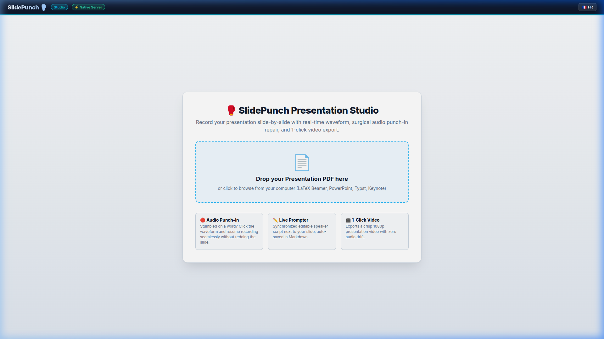

# 🎙️ SlidePunch 🥊

> **Slide-by-slide presentation recording studio that runs entirely in your browser — live waveform, punch-in audio repair, camera overlay, synchronized teleprompter, and 1-click 1080p MP4 export. No install, no server, nothing uploaded.**

<p align="center">
  <a href="https://bonben.github.io/slidepunch/" target="_blank">
    
  </a>
  <br><br>
  <a href="https://bonben.github.io/slidepunch/" target="_blank">
    
  </a>
  &nbsp;
  <a href="https://www.youtube.com/watch?v=a1E1wGVw_uk" target="_blank">
    
  </a>
</p>

<p align="center">
  <a href="https://opensource.org/licenses/MIT"></a>
  <a href="https://www.python.org/"></a>
  <a href="#requirements"></a>
  <a href="https://bonben.github.io/slidepunch/"></a>
  <a href="https://github.com/bonben/slidepunch"></a>
</p>

---

## ✨ Features

- 📂 **Multi-Project Management:** Create and organize multiple presentations with their own slide sets, speaker notes, and audio takes.
- 📄 **1-Click PDF Slide Import:** Upload any PDF presentation. Slides are automatically extracted as crisp 1080p slide images.
- 📊 **Real-time Live Audio Waveform:** Visual amplitude envelope drawn live as you speak, showing pauses, breaks, and speech bursts.
- 🔴 **Sample-Accurate Punch-In Audio Repair:** Stumbled on a word at `00:14.2`? Click on the waveform, preview, and resume recording from that exact spot without re-recording the whole slide.
- ✏️ **Synchronized Editable Teleprompter:** Live speech notes side-by-side with your slides, automatically saved to Markdown (`notes.md`).
- 🎬 **1-Click 1080p Video Generation:** Stitches your slide images and audio into a professional 1080p MP4 video with high-quality audio and zero sync drift.
- 🌐 **Bilingual Interface (EN / FR):** Instant one-click toggle between English and French.
- 🪶 **No backend, nothing uploaded:** vanilla JavaScript, no build step, no server. Your slides, recordings and video never leave your machine — projects live in the browser's own storage (IndexedDB). A few libraries (PDF.js, JSZip, MediaPipe, mp4-muxer) load from a CDN, so the first load needs an internet connection.

---

## 🚀 Quick Start

### 1. Requirements
- **A recent Chrome, Edge or Chromium.** Everything runs in the browser — recording, editing and MP4 export all use browser APIs (WebCodecs, IndexedDB, MediaRecorder).
- Nothing else. No Python, no `ffmpeg`, no `poppler`, no install.

### 2. Use it
Open the hosted app: **[bonben.github.io/slidepunch](https://bonben.github.io/slidepunch/)** — that is the whole product.

Or serve the folder yourself:
```bash
git clone https://github.com/bonben/slidepunch.git
cd slidepunch
python3 serve_static.py       # http://localhost:8081
```
`serve_static.py` is a convenience only — any static file server works. It mainly exists to send `Cache-Control: no-store`, because the entire application is a single HTML file and a stale cached copy is confusing.

---

## ⌨️ Keyboard Shortcuts

| Shortcut | Action |
| :--- | :--- |
| <kbd>Space</kbd> | Start Recording / Pause / Resume |
| <kbd>Enter</kbd> | Finish & Save Slide Audio |
| <kbd>P</kbd> | Pause / Resume Recording or Toggle Audio Playback |
| <kbd>←</kbd> / <kbd>→</kbd> | Previous / Next Slide |

---

## 📁 Project Structure

```text
slidepunch/
├── serve_static.py       # Optional local static server (no-cache)
├── web/
│   └── index.html        # Web studio interface (Bilingual EN/FR)
├── projects/
│   └── my_presentation/
│       ├── metadata.json # Project metadata
│       ├── slides.pdf    # Source PDF slides
│       ├── slide_images/ # Extracted 1080p slide PNGs
│       ├── recordings/   # Recorded 48kHz WAV audio files
│       ├── notes.md      # Synchronized speaker notes
│       └── presentation_complete.mp4 # Rendered video
├── README.md
├── thumbnail.jpg
└── LICENSE
```

---

## 🛠️ How It Works

1. **Slide Ingestion:** PDF.js renders PDF pages into high-definition raster images, in the browser.
2. **Audio Streaming & Punch-In:** Audio is captured at 48kHz PCM directly via Web Audio API. When punch-in is triggered at offset $T$, the buffer is sliced at $T$ and newly recorded PCM frames are seamlessly appended.
3. **HTTP 206 Partial Streaming:** Audio playback uses byte-range streaming for instantaneous scrubbing across takes.
4. **FFmpeg Video Encoding:** Slide images are looped and coupled with their respective audio takes, then concatenated in stream-copy mode for fast, lossless 1080p video rendering.

---

## 📜 License

MIT License — Copyright (c) 2026 Mathieu Léonardon.
